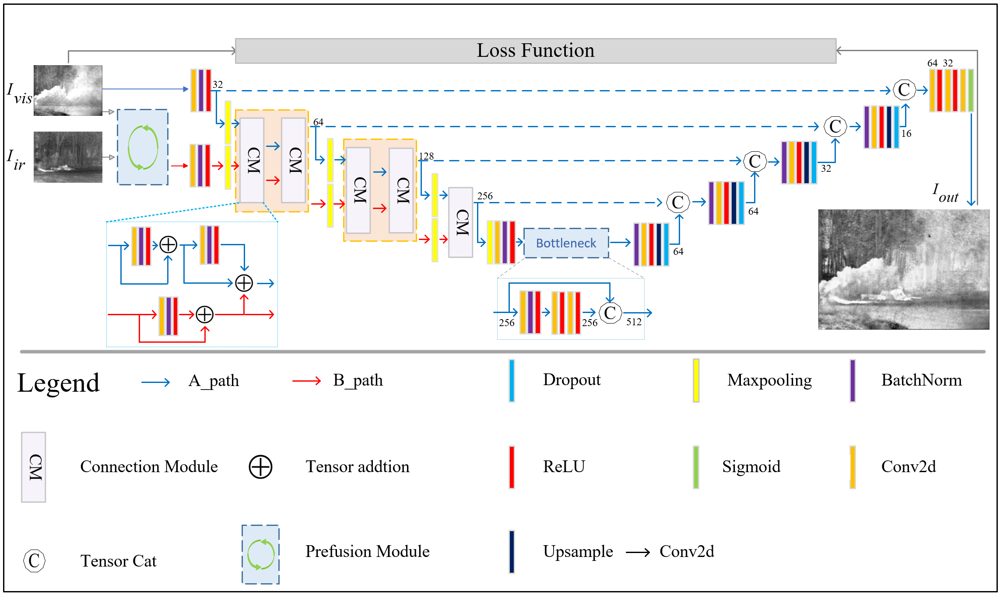
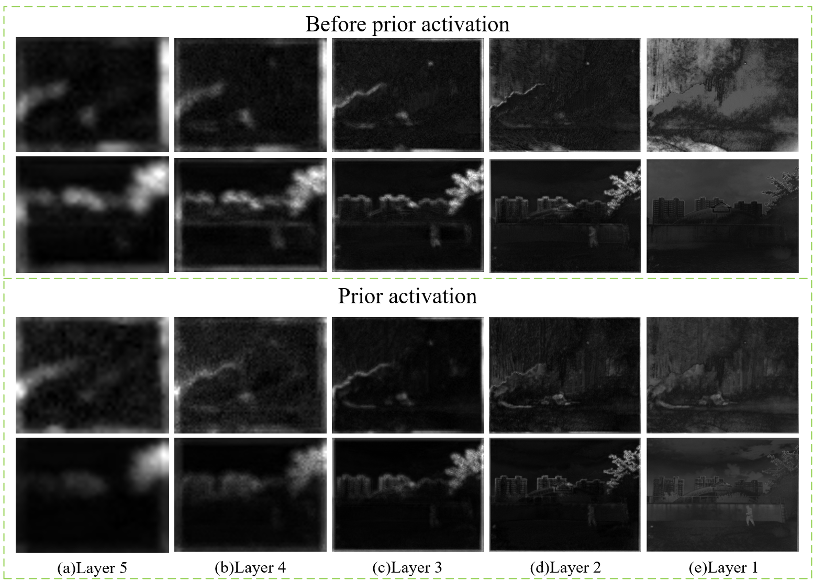
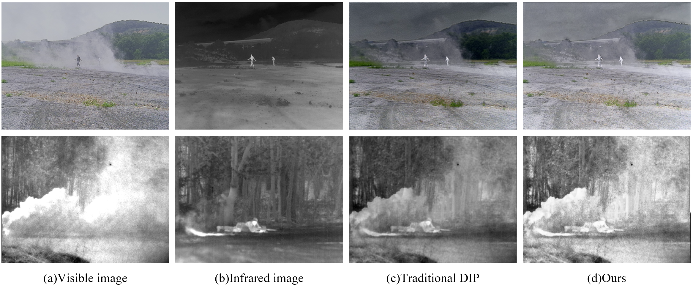
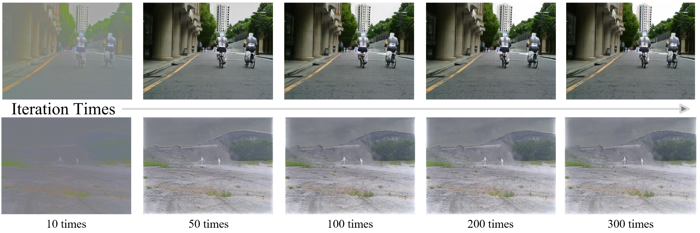
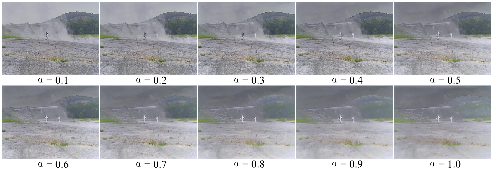

# ZVIR ⚡  
**Zero-Shot Implicit Deep Image Prior with Prior Activation for Infrared and Visible Image Fusion**

📎Note: This code is intended primarily for academic research and reproduction of paper results.

# 📌 Abstract
📌 Infrared and visible image fusion aims to generate an image that simultaneously contains features from both modalities, thereby enhancing its information richness and expressive capability. Although the deep image prior has demonstrated excellent performance in traditional inverse problems such as image restoration and denoising, conventional network structures struggle to effectively capture the joint features required for multimodal image fusion. To address this issue, we propose a fusion framework that takes the visible image as the primary degraded input and models the fusion task as the reconstruction of a fused feature image based on the visible modality. This framework leverages the internal recurrence of the fused image and introduces connection modules during the downsampling stage to enhance infrared feature representation, thereby utilizing the network structure to form a deep image prior that guides the fusion process. Experimental results further demonstrate that although the network is affected by the degraded input, its structure can still implicitly extract effective priors required for image fusion. By replacing the input image in the network path, the deep image prior can be activated to generate the target fused image. We perform both qualitative and quantitative comparisons with mainstream methods on several public infrared-visible datasets, demonstrating the effectiveness of the proposed method in terms of fusion quality and downstream task performance.

# 📌 Contributions
• To the best of our knowledge, this is the first work to apply deep image prior to the task of infrared and visible image fusion, where the network structure is leveraged to extract deep image prior for achieving zero-shot fusion.  
• A novel network architecture is proposed, in which feature priors are progressively enhanced through connection modules, allowing the network to establish different priors based on the information contained in the images themselves.  
• This research validates that the network architecture is capable of implicitly capturing deep image prior. The inhibitory effect of shallow layers on these priors can be mitigated by introducing perturbations to the input path, which facilitates the activation of deep image prior and enables the generation of the final fused image.  
• Extensive qualitative and quantitative experiments are conducted on multiple public infrared-visible datasets, validating the effectiveness of the proposed method in both fusion quality and downstream ta

# 🧠 Framework📎 
 

  

  

# 🔍 Deep Image Prior And Prior Activation
📌 In our proposed method, the infrared features are propagated only through the input path. We design a preference-aware loss function to ensure that the infrared prior is implicitly formed by the network architecture itself. We further compare our approach with the traditional DIP framework, where the DIP directly uses loss functions to extract bi-modal features and the network input is pure noise. A comparative analysis between the two is conducted.

  
 

🔍 The feature map outputs of each layer in the network architecture are visualized, intuitively demonstrating how the network suppresses infrared information. For comparison, the visualizations of prior activation are also presented, showing how both the prior and fused features are expressed within the architecture during the activation process.

    

# 📈 Reproduction

## ⚙️ Parameter Settings
📌 In our method, there are two primary parameters to be configured: the number of iterations and the parameter α. The former determines the running time of the network, while the latter controls the amount of infrared information preserved within the network. Here, we provide the recommended reference settings based on our experimental results.

   

## 🔍 Limitations
📌 Since our method relies on deep prior, both modalities are extracted directly through the network architecture itself. When the infrared and visible image edges are highly similar, or when the visible image is affected by low illumination, the fused result may be less discriminative. In such cases, the value of α needs to be adjusted, similar to manually increasing infrared preference, so that more infrared information can be introduced to enhance the fusion quality.

## ⚙️ Run Code
📌 python  train.py
